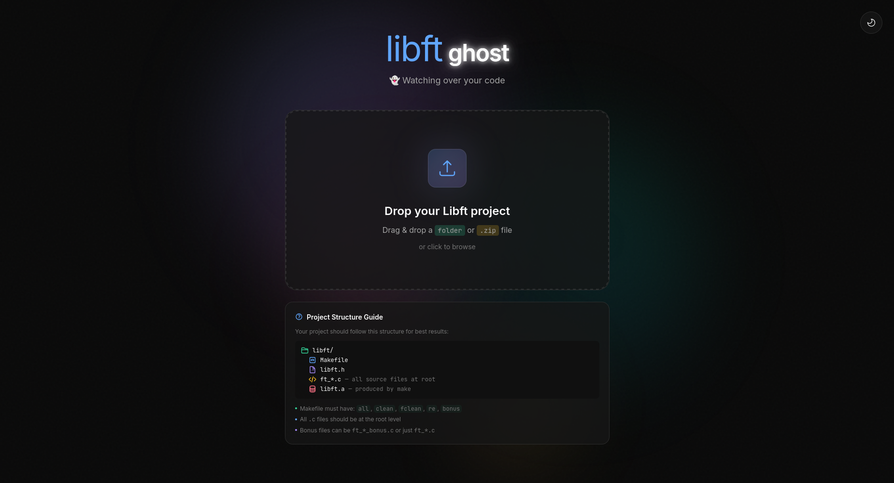
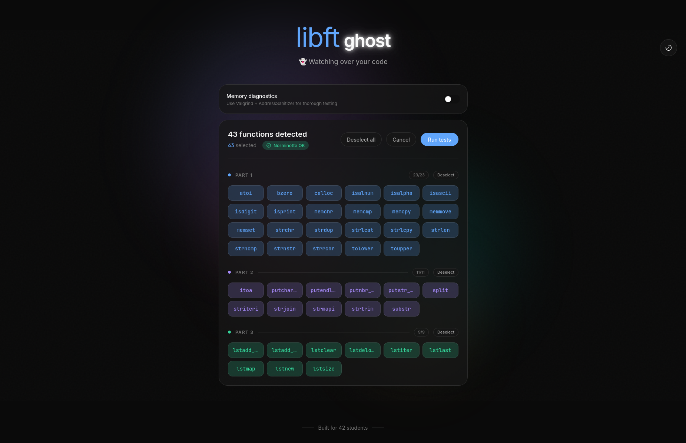
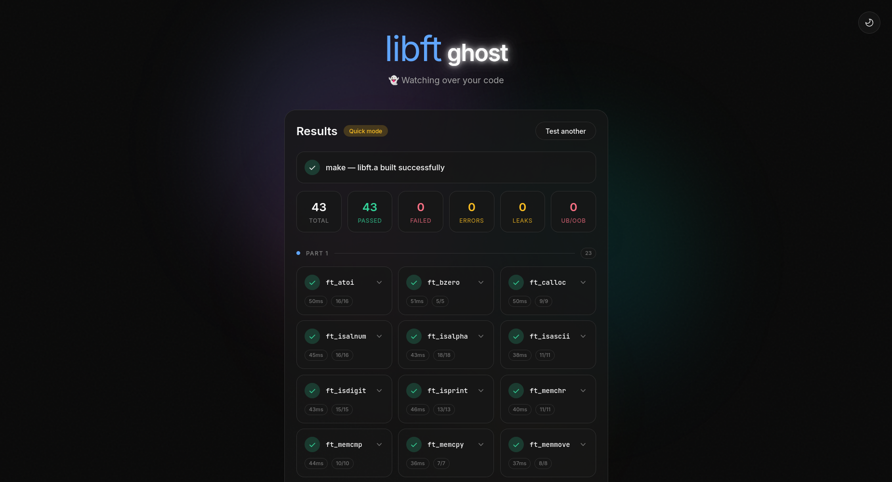

# libft-ghost 👻

[](https://ghcr.io/42staverni/libft-ghost)
[](https://42.fr)

> **The ultimate web-based libft tester for 42 School students.** Test your C library with instant feedback on compilation errors, memory leaks, buffer overflows, and norminette compliance.

**libft-ghost** is a comprehensive testing tool designed specifically for the 42 School Libft project. Unlike traditional command-line testers, this modern web application provides an intuitive drag-and-drop interface with real-time test results, memory leak detection via Valgrind, AddressSanitizer integration, and built-in norminette style checking.



## Quick Start

Get started testing your libft project in seconds:

```bash
# Pull and run with a single command
docker run -p 5173:5173 ghcr.io/42staverni/libft-ghost:latest

# Open http://localhost:5173 in your browser
```

## Features

- **Single container deployment** — Everything bundled in one Docker image, zero dependencies
- **Drag & drop uploads** — Test your libft folder directly without zipping
- **Real-time progress** — Live updates via Server-Sent Events as tests run
- **Memory leak detection** — Valgrind integration for catching memory leaks
- **Buffer overflow protection** — AddressSanitizer (ASan) and UndefinedBehaviorSanitizer (UBSan)
- **Fast mode** — Skip memory checks for 50-100ms per test speed
- **Norminette built-in** — Automatic 42 School style checking
- **Multi-architecture** — Works on Intel/AMD (x86_64) and Apple Silicon (ARM64)
- **Glassmorphism UI** — Modern, minimalist design with light/dark mode support

## How It Works



1. **Upload** — Drag & drop your libft folder or zip file containing ft_*.c files
2. **Select** — Pick which functions to test (with norminette style warnings displayed)
3. **Test** — Watch real-time progress as unit tests execute
4. **Report** — View compilation status, test results, memory leaks, buffer overflows, and edge case failures



## Why Use libft-ghost?

- **Instant feedback** — No waiting for slow test scripts; see results as they happen
- **Memory safety** — Detect leaks and buffer overflows before submitting
- **42 School compliant** — Built-in norminette checking ensures your code follows 42 style guidelines
- **No setup required** — Single Docker command gets you testing immediately
- **Cross-platform** — Works on Linux, macOS (Intel & Apple Silicon), and Windows (via Docker)
- **Comprehensive testing** — Covers edge cases, null pointer protection, and boundary conditions

## Testing Pipeline

Each function undergoes rigorous testing:

1. **Compilation check** — Compiled with `-Wall -Wextra -Werror` flags
2. **Unit tests** — Custom test harness for each ft_* function
3. **Valgrind** — Memory leak detection (optional, can be skipped for speed)
4. **AddressSanitizer** — Buffer overflow and memory corruption detection
5. **Edge case testing** — Null pointers, empty strings, boundary conditions

## Timeouts

| Mode | Per-Function | Compile | Test |
|------|-------------|---------|------|
| Quick (no memory checks) | 10s | 2s | 500ms |
| Full (with Valgrind/ASan) | 60s | 5s | 5s |

## Project Structure

```
.
├── Dockerfile              # Multi-stage build (frontend + backend)
├── .github/workflows/
│   └── docker.yml          # GitHub Actions: parallel multi-arch builds
├── backend/                # Go HTTP API
│   ├── cmd/server/         # Entry point
│   ├── internal/
│   │   ├── handler/        # Upload + test endpoints
│   │   ├── runner/         # Test execution pipeline
│   │   │   ├── runner.go
│   │   │   ├── norminette.go
│   │   │   └── detect.go
│   │   ├── middleware/     # CORS, rate limiting
│   │   └── testcases/      # C test harnesses (48 test files)
│   └── Dockerfile
└── frontend/               # SvelteKit SPA
    ├── src/
    │   ├── lib/components/ # DropZone, FunctionPicker, TestReport
    │   └── routes/         # Main app (+page.svelte)
    ├── Dockerfile.dev
    └── package.json
```

## Development

### Quick Start (Local Development)

```bash
# Terminal 1: Start the Go backend API
cd backend && go run ./cmd/server

# Terminal 2: Start the SvelteKit frontend
cd frontend && npm run dev

# Open http://localhost:5173
```

### Requirements

- Go 1.25+ and Node.js 22+
- gcc, make, and valgrind
- norminette (for 42 School style checking)
- For Valgrind on Debian/Ubuntu: `sudo apt-get install libc6-dbg`

### API Endpoints

- `GET /` — Static frontend (SPA)
- `POST /api/upload` — Upload zip/folder for testing
- `POST /api/test` — Run tests with SSE streaming
- `GET /api/health` — Health check endpoint

## Distribution (GitHub Container Registry)

### For 42 Students (End Users)

```bash
# Pull and run the latest version (works on any platform with Docker)
docker run -p 5173:5173 ghcr.io/42staverni/libft-ghost:latest

# Or use a specific version
docker run -p 5173:5173 ghcr.io/42staverni/libft-ghost:v1.0.0
```

Then open `http://localhost:5173` in your browser.

### For Maintainers (Publishing)

Images are automatically built and published to GitHub Container Registry via GitHub Actions:

- **Push to `main` branch** → Builds and pushes `latest` tag
- **Create a release** (e.g., `v1.0.0`) → Builds and pushes versioned tags

The workflow uses **parallel matrix builds** for faster multi-architecture support (AMD64 + ARM64).

#### Manual Build

```bash
# Build locally
docker build -t ghcr.io/42staverni/libft-ghost:latest .

# Multi-arch build and push
docker buildx create --use
docker buildx build \
  --platform linux/amd64,linux/arm64 \
  -t ghcr.io/42staverni/libft-ghost:latest \
  --push .

# Login and push manually
echo $GITHUB_TOKEN | docker login ghcr.io -u USERNAME --password-stdin
docker push ghcr.io/42staverni/libft-ghost:latest
```

#### Make Package Public

1. Go to GitHub → Your profile → Packages
2. Click on `libft-ghost`
3. Package settings → Change visibility → **Public**

## Troubleshooting

### Network Error When Uploading
- Ensure you're accessing `http://localhost:5173` (not `https://`)
- Check Docker logs: `docker logs <container-id>`

### Backend Won't Start
```bash
cd backend && go mod tidy && go build ./...
```

### Frontend Crashes
```bash
cd frontend && npm install && npm run dev
```

### No Functions Detected
- Ensure `ft_*.c` files are at the root of your zip/folder
- Verify your Makefile is present

### Valgrind Errors
```bash
sudo apt-get install libc6-dbg
```

### Docker Port Already in Use
```bash
# Use a different port on your host
docker run -p 5174:5173 ghcr.io/42staverni/libft-ghost:latest
# Then visit http://localhost:5174
```

## Adding Custom Tests

Create `backend/testcases/test_ft_<function>.c`:

```c
#include <stdio.h>

int main(void)
{
    // Output format: PASS|FAIL test_name expected got
    printf("PASS basic_test 5 %d\n", ft_strlen("hello"));
    return 0;
}
```

## Architecture

```
┌──────────────────────────────────────────────┐
│          Docker Container                    │
│  ┌─────────────────┐  ┌─────────────────┐   │
│  │   SvelteKit     │  │   Go Server     │   │
│  │   (Frontend)    │──│   (Backend)     │   │
│  │                 │  │                 │   │
│  └─────────────────┘  └────────┬────────┘   │
│                                 │            │
│              gcc/valgrind/norminette         │
└──────────────────────────────────────────────┘
```

## Keywords

libft tester, 42 school libft, 42 project tester, C library testing, memory leak detection, valgrind tester, norminette checker, 42 student tools, unit testing C, ft_strlen tester, ft_memcpy test, 42 cursus, Ecole 42

## License

MIT License — Built for 42 students by 42 students 👻

---

**Related:** [42 School](https://42.fr) | [Libft Project](https://42.fr) | [Norminette](https://github.com/42School/norminette)
